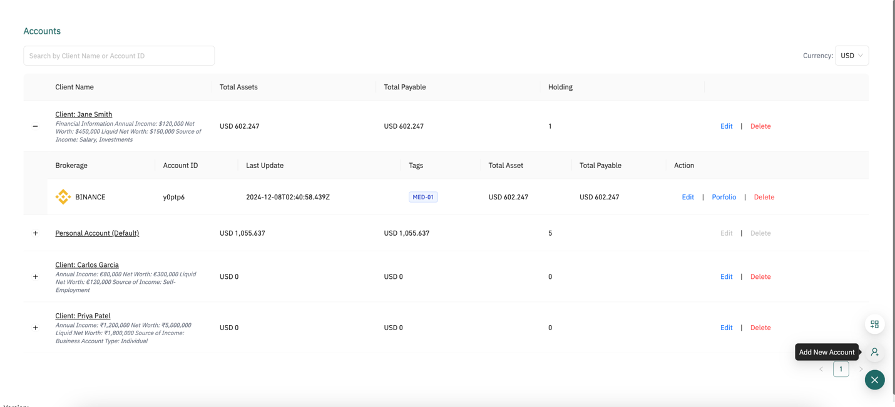
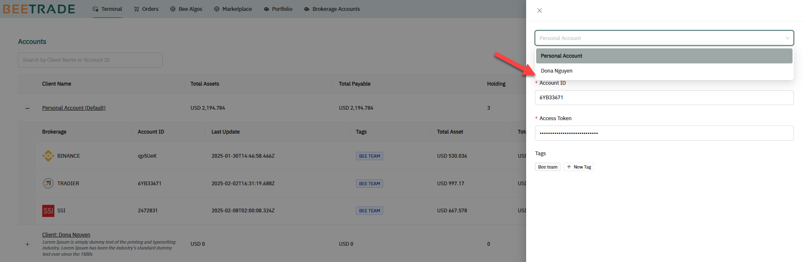
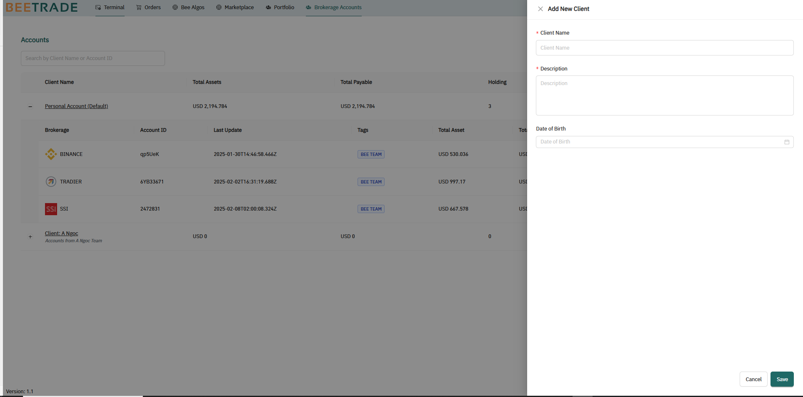

# Bee Accounts

These are the associated trading accounts that the user wants to use with Bee. This configuration is required for new users, as it will be used for other key features such as Order, Back Test, and Live Trading.

By default, there is a predefined label: [Personal Account.]{.underline} Additionally, [the user can group trading accounts by clients, but this is optional.]{.underline}

Currently, Bee supports the trading account from these brokerages:

- Binance
- SSI, DNSE in Vietnam Market. Support both **Cash and Derivative Account**

To connect to a broker account, users need provide specific authentication details, which specify by brokerage.

Click on 'Brokerage Account' from the navigation to access "Account" page, that user see all the configure trading accounts

## How to add new trading account

To add a new trading account, click on "Add New Account" from the floating button in the bottom-right corner. A trading account requires the following information:

- Brokerage: The user needs to specify the trading account and the platform it is associated with

- Depending on the selected brokerage, the user must enter the authentication information to establish a connection with the broker. There are different authentication parameters for each brokerage.

  - Binance: API Key, Secret Key
  - DNSE: Username, Password
  - SSI: Account ID, Consumer ID, Consumer Secret, Private Key

- Click on "Save" to submit. If the authentication information is correct and valid, the submission will be successful.

The list of trading accounts will be displayed in this dropdown in the navigation bar and will be used across multiple features:

## How to add a new client account

In case, user wants to group trading accounts by clients (this step is optional), clicking on "Add New Client" from the floating button in the bottom right corner of page to open the following popup

Once a new client account is created, the user can locate the trading account in the new client profile 

