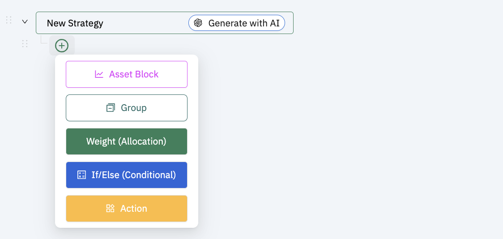
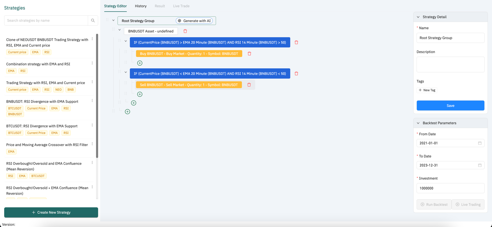
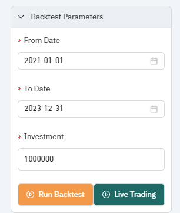
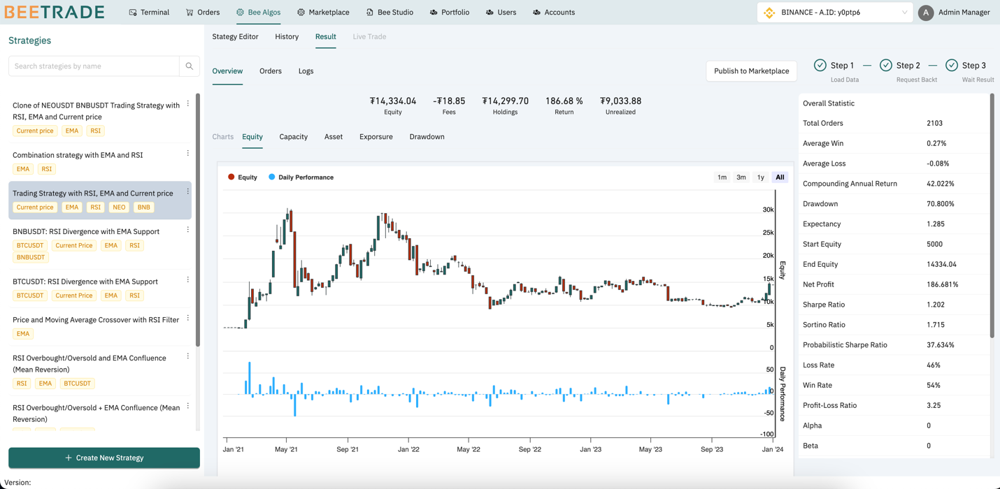

# Bee Algo 

This page allows users to design a trading strategy using custom parameters and conditions in a tree-view editor with AI. Based on predefined logic, users can run a back test to evaluate historical market data, enabling them to make informed predictions about whether to buy or sell in the future

## Intuitive Tree Editor for Strategy Management

The intuitive tree editor empowers users to seamlessly transition from strategy creation to real-time execution:

- Strategies Management: The left panel features a list of strategies, that user created. Key information, such as symbol and indicators used, is conveniently tagged for easy identification.

- Detailed strategy configuration and main actions:

  - Define your trading strategy by setting up logic for buying and selling assets using a tree-structured editor based on market conditions.
  - Configure parameters to run backtests and evaluate historical market data.
  - Trigger live trading sessions directly from the editor to put your strategy into action.
  
  

## How a trading strategy in the tree looks

A trading strategy in Bee Algo includes the following information and key components.

- **General Information**: Includes the name, description, tags, and corresponding tree data.

- **Tree Data**: The algorithms is configured and visualized in a tree view. The tree components are built to not only cover condition configurations for trading indicators/patterns but also the allocation weight and assets for specific buy/sell action. The following are main components in the tree:![A screenshot of a computer Description automatically
  

- **Group**: Like a block, is to group by sub-groups or the list of conditions and actions belongs to it. If there're more than one group, user can specify the weight for each group

- **Weight**: Define the weight of investment for each buy/sell action that's belonged it

- **Asset Block**: The asset is to use for buy/sell signal

- **If/Else** (Condition): is to define the buy/sell conditions from the technical indicators and their parameters.

- **Actions**: is to make decisions for specific signal: Buy or Sell

Each above component requires a name and the corresponding **condition/ parameters

- Component: Asset Block
  -  Conditions/Parameters: Symbol - (Required block)
- Component: Weight
  - Conditions/Parameters: Allocation Percentage [unit: %] (Optional block). If no definition, the default value is 100%)
- Component: Action
  - Conditions/Parameters: (Required block)
  - Including the following configuration:
    - Order Type [Market]
    - Order Direction [Buy, Sell]
    - Symbol
    - Toggle (Percentage): Allows the user to specify the quantity for the order either by a fixed number or as a percentage of the trading account's assets/investment cash for buying, and a percentage of the holdings in the portfolio for selling.
      - If: Toggle = Off: The quantity is fixed for buy/sell.
      - If: Toggle = On: The quantity is set as a percentage for buy/sell based on the associated assets and portfolio
- Component: If//Else 
  - Conditions/Parameters: (Required block)
  - AND/OR: Set the combination rule for multiple conditions
  - A Condition configuration include:
    - 1st Indicators and corresponding parameters
    - Operator (Greater than/Less than/Equal/Cross Over/Cross Under]
    - 2nd indicator OR a fixed value, that's used to compared to 1st indicator
    - Supported a variety of trading indicators and patterns

## 4 Steps to build a trading strategy

To easier and faster to create a trading strategy in Bee Algo, user can use AI Assistant. After clicking on "Create new strategy" button, in the creation editor, let's follow these steps:

- Step 1: Describe your desired strategy to the AI.

  - By clicking on the button "**Generate with AI"** in the root group of tree view which likely automates strategy generation based on predefined or learned indicators and parameters. In this screen, tell AI what you want to build
> For example: Create a trading strategy for BNBUSDT assets as follows: Buy when the price is above the EMA and the RSI is above 50. Sell when the price is below the EMA and the RSI is below 50*

- Step 2: Review the generated tree view with explanations.

  - AI will automatically return a strategy data response as the tree view and an explanation for that tree data. So that manual review is necessary

- Step 3: Use the AI-generated tree data to make further edits as needed in each component.

  - If user wants to use the tree data returned from AI, clicking on "Use this", AI suggested strategy will be filled into the tree editor.

  - Next steps: User can add new or edit or delete the data for each component in the tree editor. Refer to section: "How a trading strategy in the tree looks" to get more detailed the components configuration in this step

- Step 4: Confirm general information (name, description, tags) and save the strategy

## Trigger Back-test on Bee Algo

Once the user can save the strategy successfully, this means the algorithm configuration is valid, ready for running the back test or live trade.

Backtest Setups:

To run a backtest from a trading strategy, user need to define the parameters for backtesting first, this section allows you to:
- From Date: Select the start date for backtest (e.g., January 1, 2021).
- To Date: Select the end date for backtest (e.g., December 31, 2023).
- Investment: Input the total capital you want to allocate for the strategy during the backtest.

When the parameters are set, click "**Run Backtest"** to simulate the strategy based on selected historical data

The backtest will be proceed during main 3 steps:

- Step 1: Loading the data. Note: Currently, the system only supports the data resolution daily, make sure the parameters of used technical indicators are daily
- Step 2: Request the backtest. Using the conditions defined in tree view, run with the historic trading data.
- Step 3: Wait and visualize the backtest result (statistic key, charts, order)

Optional: If user want to share this backtest result and strategy to the community, clicking on "Publish to Market Place" button in the Overview tab. This step is optional

#### Detailed Backtest Result

There're 3 tabs are displayed in Backtest Result:

- Overview
  - Overview statistic:
    - Equity: The total portfolio value of all the holdings was sold at current market rates.
    - Fees: The total quantity of fees paid for all the transactions.
    - Holdings: The sum of all items in the portfolio
    - Return: The rate of return across the entire trading period
    - Unrealized: The amount of profit a portfolio would capture if it liquidated all open positions and paid the fees for transacting and crossing the spread.
  - Charts: Some of the build--in charts are shown to help users analyze performance of the algorithm.
    - Equity: Time series of equity and daily performance.
    - Exposure: Time series of long and short exposure ratios. This chart indicates the risk of the strategy, the bigger the gap between 2 ratios, the higher the risk is.
  - Overall Key Statistics: Here is the description of each component in the statistics table

| **PSR**                                                                    | The probability that the estimated Sharpe ratio of an algorithm is greater than a benchmark.                                                           |
| -------------------------------------------------------------------------- | ------------------------------------------------------------------------------------------------------------------------------------------------------ |
| **Sharpe Ratio**                                                           | A measure of the risk-adjusted return, developed by William Sharpe.                                                                                    |
| **Total Trades**                                                           | The number of orders that were filled or partially filled.                                                                                             |
| **Average Win**                                                            | The average rate of return for profitable trades.                                                                                                      |
| **Average Loss**                                                           | The average rate of return for unprofitable trades.                                                                                                    |
| **Compounding Annual Return**                                              | The annual percentage return that would be required to grow a portfolio from its starting value to its ending value.                                   |
| **Drawdown**                                                               | The largest peak to trough declines in an algorithm's equity curve.                                                                                    |
| **Expectancy**                                                             | The expected return per trade.                                                                                                                         |
| **Net Profit**                                                             | _(Percent)_ The rate of return across the entire trading period.                                                                                       |
| _(Dollar-value)_ The dollar-value return across the entire trading period. |
| **Loss Rate**                                                              | The proportion of trade that was not profitable.                                                                                                       |
| **Win Rate**                                                               | The proportion of trade that was profitable.                                                                                                           |
| **Profit-Loss Ratio**                                                      | The ratio of the average win rate to the average loss rate.                                                                                            |
| **Alpha**                                                                  | The quantity of an algorithm's returns isn't explained by its underlying benchmark.                                                                    |
| **Beta**                                                                   | The scale and direction of an algorithm's returns relative to movements in the underlying benchmark.                                                   |
| **Annual Standard Deviation**                                              | A statistical measure that describes the dispersion of annual returns relative to the mean annual return. It's the square root of the annual variance. |
| **Annual Variance**                                                        | A statistical measure that describes the dispersion of annual returns relative to the mean annual return.                                              |
| **Information Ratio**                                                      | The number of excess returns from the risk-free rate per unit of systematic risk.                                                                      |
| **Tracking Error**                                                         | A measure of how closely a portfolio follows the index to which it is benchmarked. A tracking error of 0 is a perfect match                            |
| **Treynor Ratio**                                                          | A measurement of the returns earned in an algorithm in excess of the risk-free rate per unit of benchmark risk, developed by Jack Treynor.             |
| **Total Fees**                                                             | The total quantity of fees paid for all the transactions.                                                                                              |
| **Estimated Strategy Capacity**                                            | The maximum amount of money an algorithm can trade before its performance degrades from market impact.                                                 |
| **Lowest Capacity Asset**                                                  | The asset an algorithm traded that has the lowest capacity.                                                                                            |

- Orders: The list of virtual orders that's triggred during the backtest

- Error Logs: Logs tab displays the error logs of the backtest if any issue happens

## Trigger a live trade process for a trading strategy:

In strategy details, clicking **Live Trading** to start executing the strategy in real-time using actual payable assets & current portfolio of selected account.

Live trading result will display real-time in the live trade tab. The live trading result are like backtest result, but the differences are:

- Actual Orders & Real-time Equity: Based on the algorithm of the strategy, the system will place orders that are executed in real-time in the market. Live trading involves real money, meaning any gains or losses impact the user's account actual funds.

- Real-time Orders and Backtest logs

When user want to cancel the live trading, clicking on "Stop" to cancel the process 