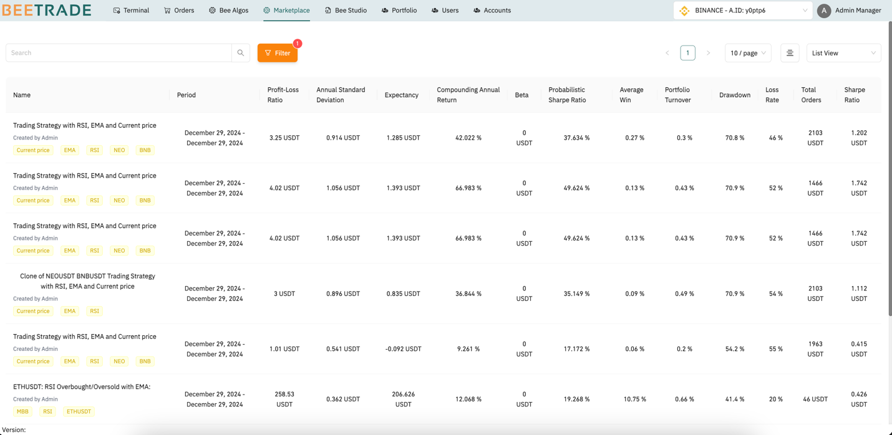
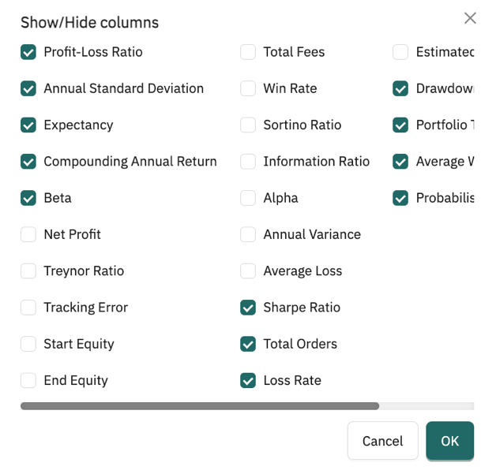
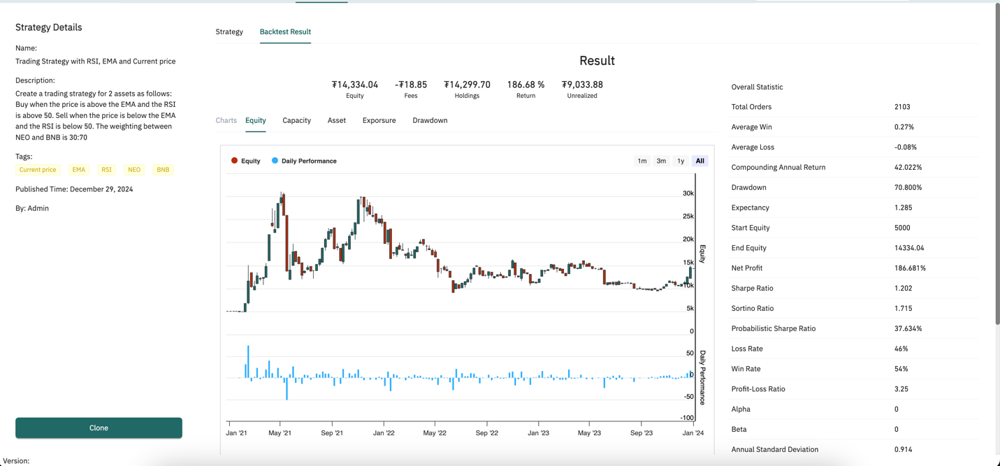

# Bee Marketplace 

From Bee Algo, user can share your trading strategy and performance result from backtest to the Beelab community. All user's able to access shared trading strategies. These strategies include algorithms data under a tree structure, along with performance metrics from their back testing results.

With the supported two view modes, users can browse the list of shared strategies using a comprehensive filter with dynamic combinations to filter by performance metric values. User can also customize the data displayed in the list

To view the details of a strategy, click on a record to be redirected to the detailed page, as shown in the following screenshot

Users can clone a strategy to edit or further enhance them by clicking on "Clone" 