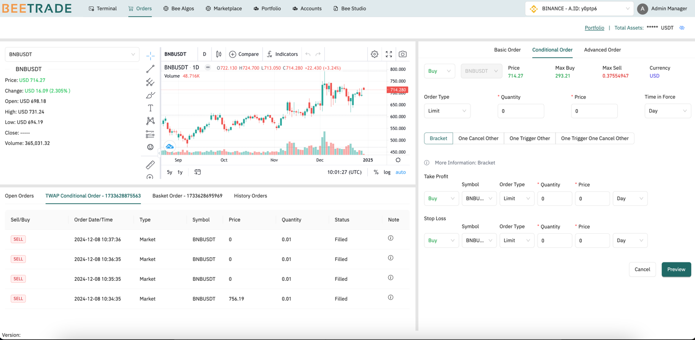
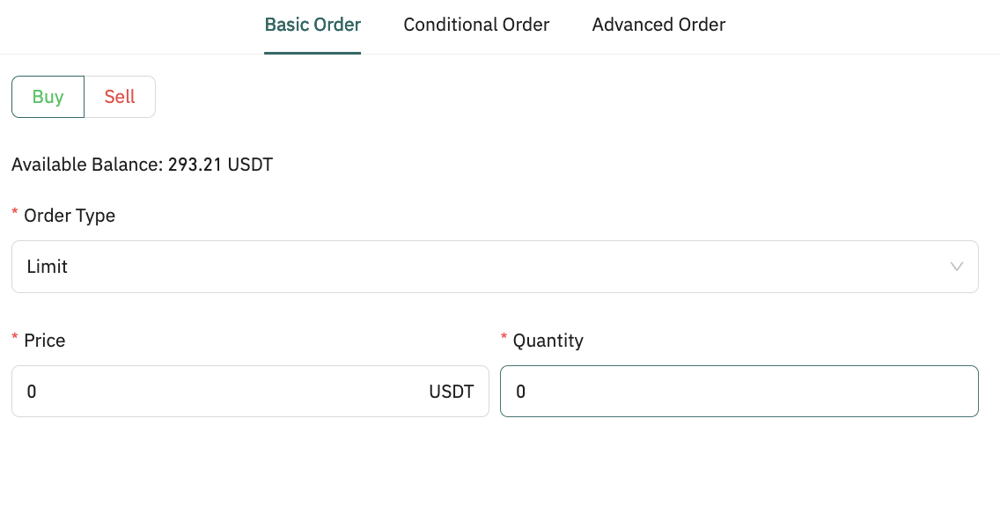
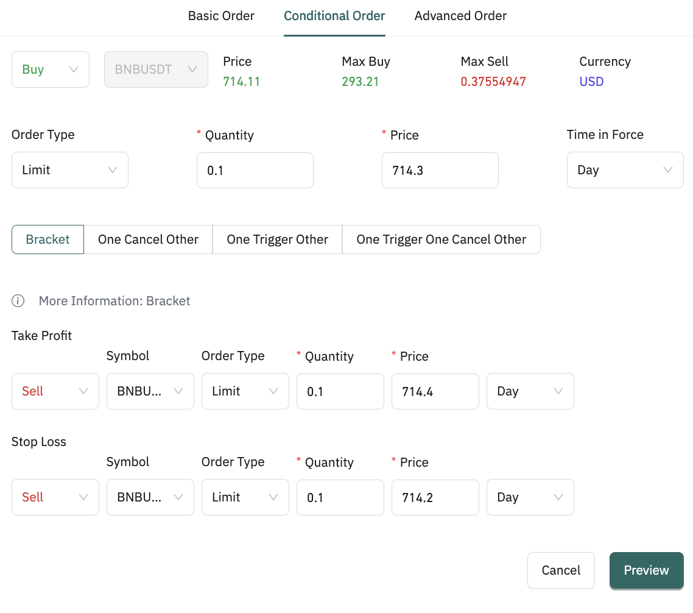
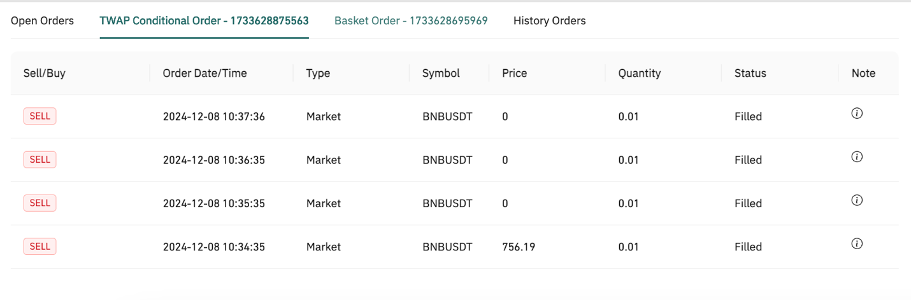

# Bee Orders

This feature is used corresponding to a specific trading account. In order to create an order for the broker, the user needs to make sure that the selected trading account's connection is valid.

Once user selects a brokerage account, the application displays the asset of the associated account in the top right corner.

## How to create new order(s)

To create an order, nested orders, or a set of orders, follow these basic steps:

- Step 1: Select a specific symbol to see the detailed information and stock data history in the trading view

- Step 2: Select one of 3 order creation options: Basic Order \| Conditional Order \| Advanced Order

  - Currently, the application support 2 order type: Limit & Market
  - The input of an order requires:

    - Symbol name: By default, the symbol is selected symbol that is user selected in the first step. User can change it if needed
    - Order Side: Buy or Sell
    - Order type: Limit or Market
    - Quantity
    - Price: Corresponding to the selected broker account, the currency will be displayed. If order type is market, the price will be the current data market pricing

    - Time in Force:

      - GTD: Good Till Date | Orders remain in effect until the end of the designated day of expiration or until specifically canceled or filled.
      - GTC: Good Till Canceled |Orders remain in effect from day-to-day until specifically canceled or filled

- Click on "Submit Order" to complete

## What is the different between Basic \| Conditional \| Advanced Order

- Basic order: For creating a single order. It could be a limit order or market order
  

- Conditional order: For creating combination/ conditional order based on 2 types of order (limit, market), including:
  

  - Bracker Order: help user avoid losses and lock in profits by \"bracketing\" an order with two opposing orders, including:

    - Primary order: A BUY order is bracketed by a sell limit order on the upside and a sell stop order on the downside.
    - Secondary orders: 2 SELL orders are a buy limit order on the upside (take profit order) and a buy limit order on the downside (stop loss order)

- One Cancel Other: To create multiple potential orders based on specified conditions. Once the first of potential order(primary) is filled (including partial filled), the remaining orders are immediately to be canceled

- One Trigger Other: is a type of conditional order where the execution of a primary order triggers the placement of one or more secondary orders.

- One Trigger One Cancel Other: Allow to create a primary order which, if executed, triggers the secondary orders. If either of these secondary orders is executed, the other is automatically canceled.

- Advanced order: Support user to create multiple orders.

  - [Basket order]{.underline}: Basket orders support user to create a single transaction to buy or sell a group (or \"basket\") of multiple stocks or other securities simultaneously.
    

   - TWAP: TWAP order is a trading order strategy that helps traders to bull or sell to attain this average price over a set time period.
     - TWAP algorithm calculates the average price between the time the order is submitted and when it\'s completed. The goal is to keep the price close to the true market price

## How to monitor the orders that's triggered from Bee

Once the user submits the order, user can track the status of order in these panel:

Important Notes:

- All orders that's triggered from Bee are stored and displayed in Open Order/ Baset / TWAP Order and History Tab

  - If any orders are triggered but not from Bee, they will be displayed here.
- For conditional orders the application will hold the secondary orders to wait for the status of the primary order.

- An indicator is to let users know whether the order has been successfully submitted to the broker or not. The cancellation icon is displayed in each order and is available to trigger a cancellation request.

  - If cancellation icon is not displayed, it means that the order is held in the application (with conditional order) or that the order is invalid to submit to the broker (the application checks the validity of the order before submitting it to the broker)

- For an invalid status, the user can view the detailed reason by hovering the mouse over the icon in the Note column. 