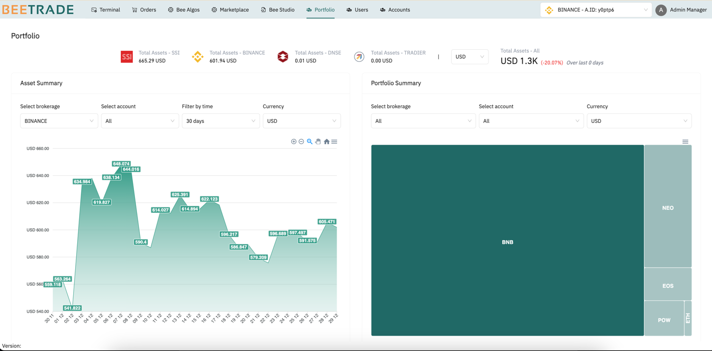

# Bee Portfolio 

This module helps user to manage total assets and portfolios across all client and associated trading accounts.

- Total assets are aggregated daily to reflect changes, with options to filter by specific brokerages and accounts.

- Portfolio charts display the holdings, including the number of stocks, symbols, and their percentage contributions to the user's overall portfolio in Bee. 
- 
