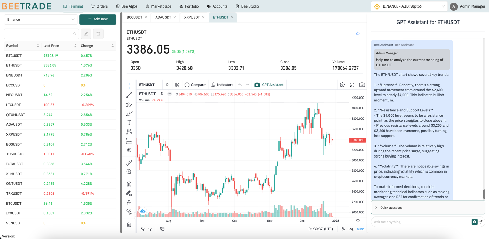
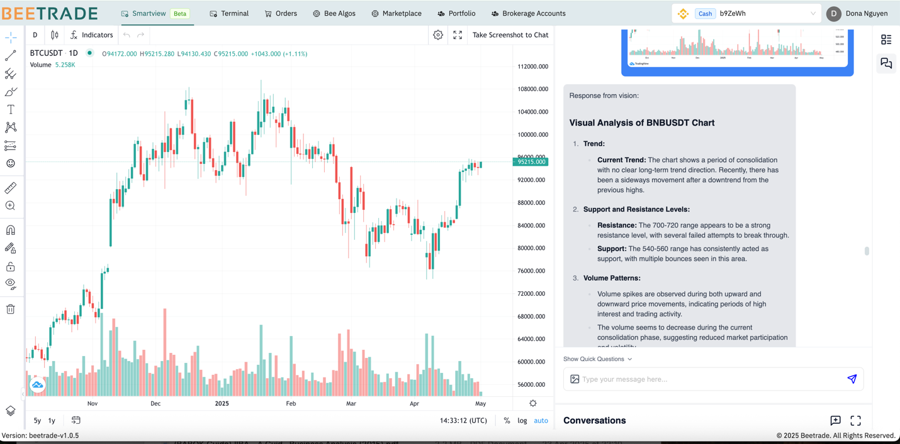

# Bee Terminal / SmartView

The main function of this page is to help the user see the market data from the different sources and take advantage of GPT to analyze the context from trading view screenshots.

> Note: Please make sure that you have already selected a brokerage account in the navigation bar. The list of stocks and the watchlist will be displayed according to the selected brokerage accounts.

## How to create a new conversation in the GPT Assistant

- Choose a symbol in the left panel, user can search or find the stock from the watchlist.

  - The selected stock information will be display in the middle panel with trading view
  - If selected stock information has GPT Assistant history, the system also shows the history chat in GPT Assistant panel.

- In the trading view, click on "GPT Assistant" or click on "Camera" icon in chat panel, the application will take a screenshot from the current trading view as image.

  - User can ask GPT or use some suggestions question to ask GPT helps based on the screenshot context

For each symbol, the application will save the GPT chat as a conversion. In the future, this conversion data will be used to improve the GPT response.

A new version of Terminal has been developed, named Smart View. In addition to analyzing trading view screenshots, the new AI agent supports querying market data and conducting deep research and reports 

